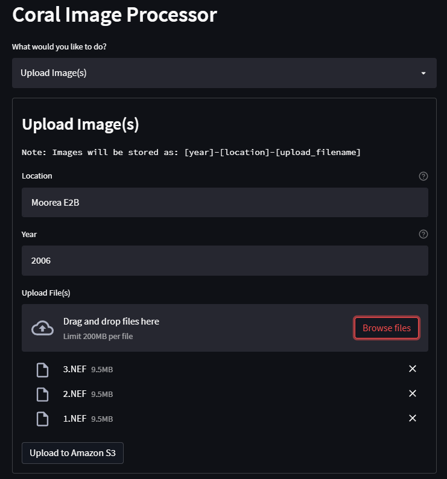
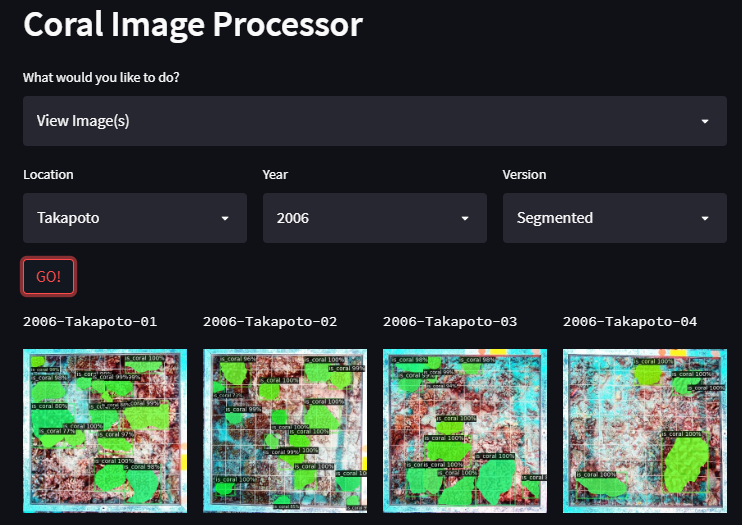
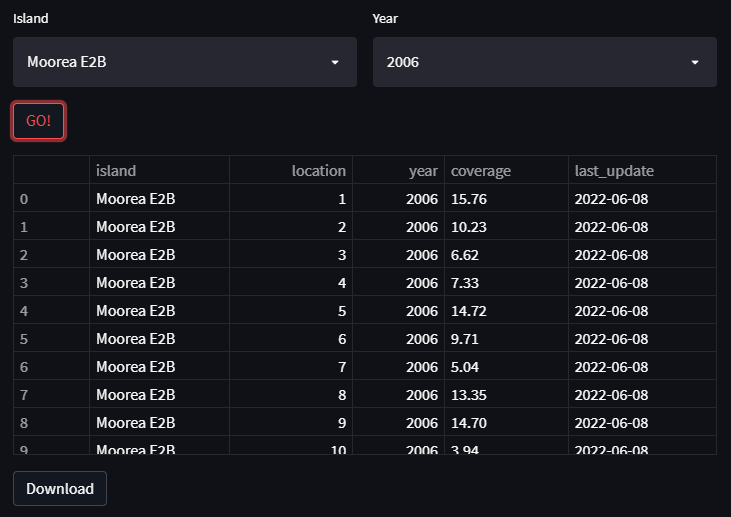

# coral-reefs
Analyse coral growth images with deep learning. Student Project, [Data
ScienceTech Institute](https://datasciencetech.institute).

## About
The aim of this project is to support oceanographers at [CRIOBE](http://www.criobe.pf/eng/)
in their study of coral reefs in the pacific ocean. 
  
Researchers should be able to upload raw images of coral reefs to the application, which will apply 
automated image treatment steps before executing a segmentation model to detect corals present on 
the image and generating statistical data for further analysis.

### Implemented Features
- Apply underwater image enhancements
- Apply perspective correction
- Crop to frame
- Detect coral
- Generate statistics about coral coverage

## Available Versions
- Serverless implementation using Amazon Web Services 
- Local deployment using Docker 
- View the respective directories for more information

## Use
- Upload raw images of corals via the image upload menu 

- View existing images in the image view menu

- View or export statistics via the statistics menu

## Project Team
### Students
**Mohammed BOUAYOUN**  
mohammed.bouayoun@edu.dsti.institute  
Applied MSc in Data Science and AI

**Albert KONRAD**  
albert.konrad@edu.dsti.institute  
Applied MSc in Data Engineering for AI  

**Noah MARVISI**  
noah.marvisi@edu.dsti.institute  
Applied MSc in Data Science and AI

**Pauline SALIS**  
pauline.salis@edu.dsti.institute  
Applied MSc in Data Science and AI

### Instructor
**Assan SANOGO**  
assan.sanogo@dsti.institute  
Data Scientist
