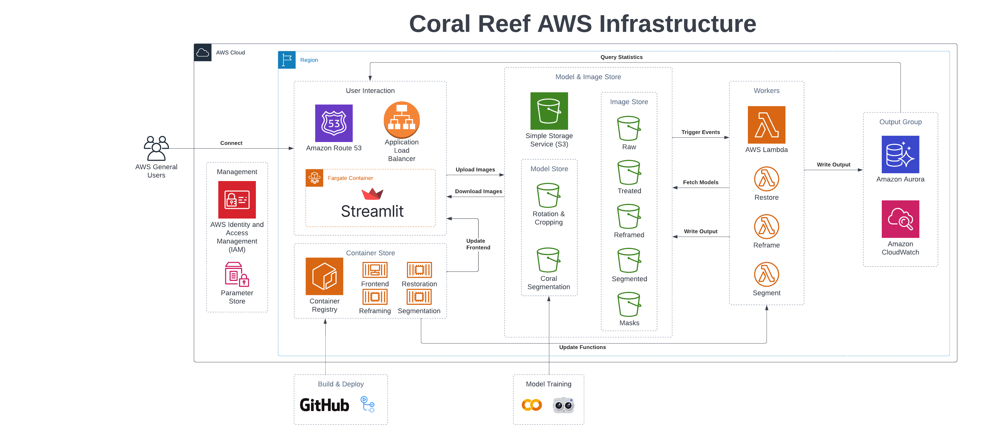

# Deploy on Amazon Web Services 

## Summary
This is a serverless implementation of the solution on Amazon Web Services. 

- The application frontend runs in ECS Fargate
- All compute workloads are handled by Amazon Lambda
- Statistical coral data is stored in Amazon Aurora

## Architecture 

## Deployment 
TBD